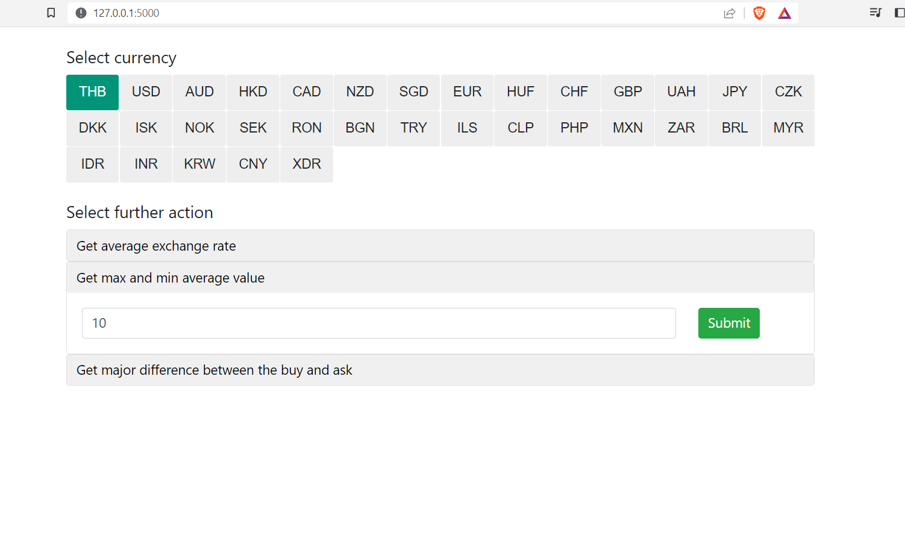

# Internship NBP API App

An app written with Flask providing certain data from public NBP API 

### How to run app

Clone the git repository
```
$ git clone https://github.com/o-serafin/dynatrace_2023
```
Enter project directory and build docker image
```
$ cd dynatrace_2023
$ docker build --tag python-docker . 
```
Run container with:
```
$ docker run -d -p 5000:5000 python-docker
```
Visit http://127.0.0.1:5000/ or localhost:5000 in your local browser

### How to use it

UI

If you visit http://127.0.0.1:5000/ you will see Bootstrap 4 UI for application where you can perform 3 available operations

 - With date (formatted YYYY-MM-DD) and a currency code get its average exchange rate. Available at /exchanges endpoint
 - With currency code and the number of last quotations N, get two days with max and min exchange rate in given interval. Available at /min-max endpoint
 - With currency code and the number of last quotations N, get major difference between the buy and ask rate, with a date of day. Available at /major-diff endpoint



or by COMMANDS

Accessing /exchanges endpoint:
```
$ curl http://127.0.0.1:5000/exchanges/{currency}/{date}
```
Example command (date should be in YYYY-MM-DD format):
```
$ curl http://127.0.0.1:5000/exchanges/NOK/2022-06-22
```
will return a string
```
0.4455
```

Accessing /min-max endpoint
```
$ curl  http://127.0.0.1:5000/max_min/{currency}/{n}
```
Example command
```
$ curl http://127.0.0.1:5000/min-max/AUD/10
```
will return a dictionary
```
{"max_exch_rate":2.8445,"min_exch_rate":2.7762}
```

It contains the values of minimum and maximum exchange rate over interval of last n days.

Accessing /major_diff endpoint

```
$ curl http://127.0.0.1:5000/major_diff/{currency}/{ns}
```
Example command
```
$ curl http://127.0.0.1:5000/major-diff/CHF/10
```
will return a dictionary
```
{"date":"2023-04-13","difference":"0.0948"}
```

The answer contains max daily differecne between values of a bid and ask over n day period from now, and date when it happened.

### Tests

Once you have container running on yor machine, open new CMD window and navigate to place where downloaded repo resides.
Then type:
```
$ python tests.py
```
You should see a message that all 8 tests were performed correctly. 
!!! Note that tests were made as for 25.04.2023 and after some time, operations 
test_min_max_avg_value and test_major_diff might present other values, as they operate on constantly changing data !!!

